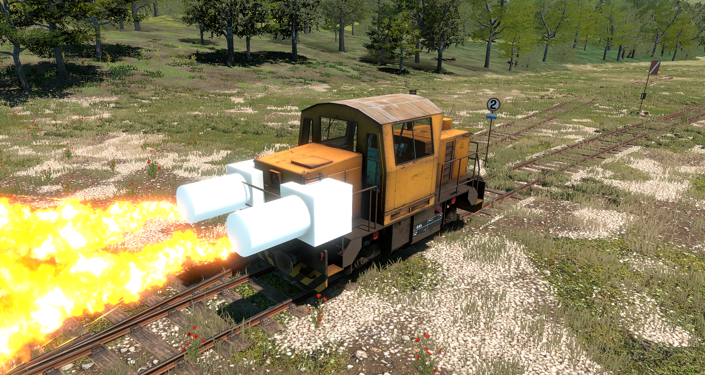
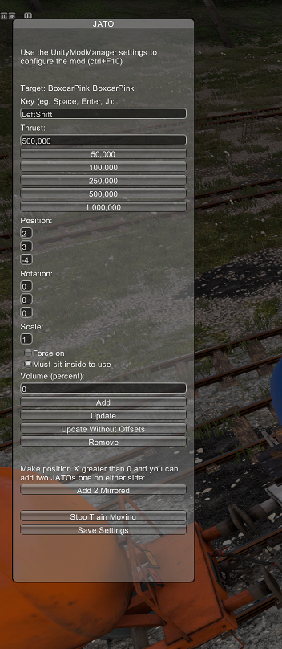
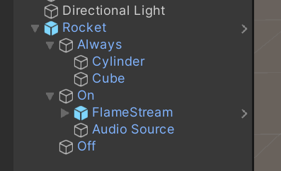

# Derail Valley Universal JATO mod

A mod for the game [Derail Valley](https://store.steampowered.com/app/588030/Derail_Valley/) that lets you add JATO rockets to any train car:

## Install

Download the zip and use Unity Mod Manager to install it.

## How to use

1. Press alt to open the in-game UI
2. Click the button "UJ" in the top left corner
3. Configure and add

Default key is "LeftShift"

I strongly recommend you add [DV Utilities](https://www.nexusmods.com/derailvalley/mods/631) to disable derailment!

## Known issues

- audio doesn't work

## Replacing the rocket mesh

1. Create Unity 2019 project
2. Create prefab named whatever
3. Create AssetBundle named "rocket" and place into modfolder/Dependencies/AssetBundles

Prefab should look like:

Where "on" is shown when boosting and "off" is when not. Audio source volumes are forced to whatever the user configures.

## Development

Template from https://github.com/derail-valley-modding/template-umm

Created in VSCode (with C# and C# Dev Kit extensions) and MSBuild.

1. Run `msbuild` in root to build

## Publishing

1. Run `.\package.ps1`
